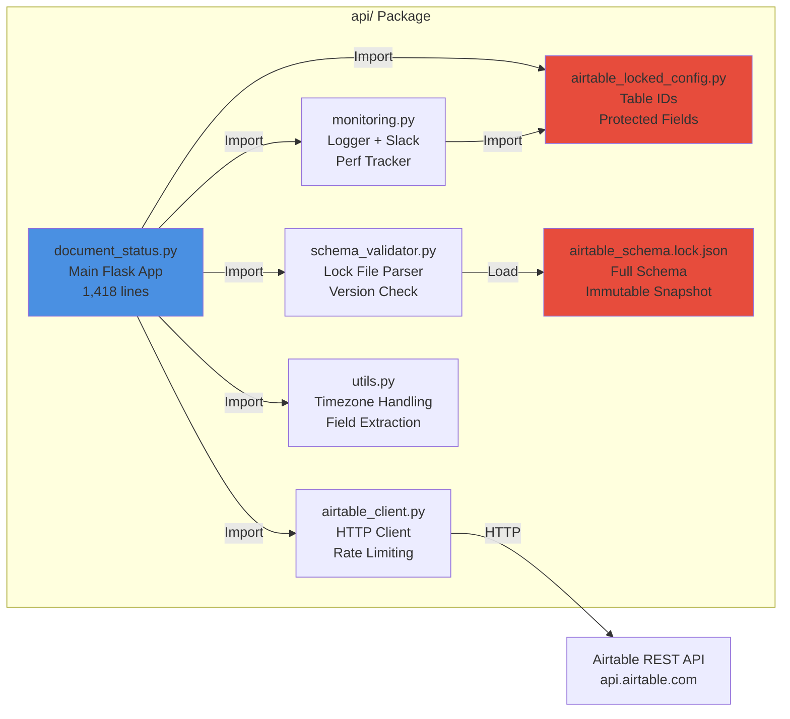

# GETS Logistics API - System Architecture

## 📋 Document Information

**Project**: GETS Logistics API for HVDC Project
**Version**: 1.7.0 (SpecPack v1.0 + Locked Mapping)
**Last Updated**: 2025-12-25
**Timezone**: Asia/Dubai (+04:00)
**Deployment**: Vercel Serverless (Production)
**Production URL**: https://gets-logistics-api.vercel.app
**Schema Version**: 2025-12-25T00:32:52+0400

---

## 🎯 System Overview

GETS (Global Equipment Tracking System) Logistics API는 HVDC 프로젝트의 선적 물류 관리를 위한 실시간 RESTful API입니다. Airtable을 SSOT(Single Source of Truth)로 사용하며, ChatGPT Actions를 통한 자연어 인터페이스를 제공합니다.

### Key Features

- **실시간 데이터 동기화**: Airtable API 직접 연동 (5 RPS)
- **Schema Lock**: 스키마 버전 관리 및 필드 보호 (20 protected fields)
- **Serverless Architecture**: Vercel Functions (콜드 스타트 최적화)
- **ChatGPT Integration**: OpenAPI 3.1 스키마 기반 Actions
- **Monitoring & SLA**: 응답 시간, 에러율, 병목 추적

---

## 🏗️ System Architecture Diagram

```mermaid
graph TB
    subgraph "Client Layer"
        GPT[ChatGPT<br/>Custom GPT Actions]
        DASH[Dashboard/BI<br/>Direct REST Calls]
        OPS[Operations Bots<br/>Automation]
    end

    subgraph "API Gateway"
        VERCEL[Vercel Edge Network<br/>Global CDN]
    end

    subgraph "Application Layer - Vercel Serverless"
        FLASK[Flask API<br/>document_status.py]

        subgraph "Core Modules"
            AIRTABLE_CLIENT[Airtable Client<br/>Rate Limiting: 5 RPS]
            SCHEMA_VAL[Schema Validator<br/>Lock Version: 2025-12-25]
            MONITOR[Monitoring<br/>Perf + SLA Tracking]
            UTILS[Utilities<br/>Timezone, Parsing]
        end

        FLASK --> AIRTABLE_CLIENT
        FLASK --> SCHEMA_VAL
        FLASK --> MONITOR
        FLASK --> UTILS
    end

    subgraph "Data Layer"
        AIRTABLE[(Airtable Base<br/>appnLz06h07aMm366)]

        subgraph "10 Tables"
            SHIPMENTS[Shipments<br/>36 records]
            DOCUMENTS[Documents<br/>Doc Status]
            APPROVALS[Approvals<br/>Type + SLA]
            ACTIONS[Actions<br/>Next Steps]
            EVENTS[Events<br/>Audit Log]
            EVIDENCE[Evidence<br/>Attachments]
            BOTTLENECK[BottleneckCodes<br/>Risk Matrix]
            OWNERS[Owners<br/>Assignees]
            VENDORS[Vendors<br/>Suppliers]
            SITES[Sites<br/>Locations]
        end

        AIRTABLE --> SHIPMENTS
        AIRTABLE --> DOCUMENTS
        AIRTABLE --> APPROVALS
        AIRTABLE --> ACTIONS
        AIRTABLE --> EVENTS
        AIRTABLE --> EVIDENCE
        AIRTABLE --> BOTTLENECK
        AIRTABLE --> OWNERS
        AIRTABLE --> VENDORS
        AIRTABLE --> SITES
    end

    subgraph "Configuration"
        LOCK_CONFIG[airtable_locked_config.py<br/>Table IDs + Protected Fields]
        LOCK_SCHEMA[airtable_schema.lock.json<br/>Full Schema Snapshot]
    end

    GPT --> VERCEL
    DASH --> VERCEL
    OPS --> VERCEL
    VERCEL --> FLASK
    AIRTABLE_CLIENT --> AIRTABLE
    SCHEMA_VAL --> LOCK_SCHEMA
    FLASK --> LOCK_CONFIG

    style GPT fill:#10a37f
    style VERCEL fill:#000
    style FLASK fill:#000080
    style AIRTABLE fill:#fcb400
    style LOCK_CONFIG fill:#ff6b6b
    style LOCK_SCHEMA fill:#ff6b6b
```



---

## 📊 Data Flow Diagram

```mermaid
sequenceDiagram
    participant GPT as ChatGPT
    participant VERCEL as Vercel Edge
    participant API as Flask API
    participant VALIDATOR as Schema Validator
    participant CLIENT as Airtable Client
    participant AIRTABLE as Airtable Base

    GPT->>VERCEL: GET /approval/summary
    VERCEL->>API: Route to /api/document_status

    API->>VALIDATOR: Validate schema version
    VALIDATOR-->>API: ✓ Lock match (2025-12-25)

    API->>CLIENT: list_records("Approvals")
    CLIENT->>CLIENT: Check rate limit (5 RPS)
    CLIENT->>AIRTABLE: GET /v0/appnLz06h07aMm366/Approvals
    AIRTABLE-->>CLIENT: JSON records + offset
    CLIENT->>CLIENT: Paginate (100/page)
    CLIENT-->>API: Aggregated records

    API->>API: Compute SLA buckets<br/>(D-5, D-15, Overdue)
    API->>API: Classify by type<br/>(DOC_BOE, APPR_FANR, etc)

    API-->>VERCEL: JSON Response
    VERCEL-->>GPT: 200 OK + Data
```



---

## 🔧 Component Architecture



---

## 🌐 API Endpoints

### **Core Endpoints (9 total)**

```mermaid
graph TB
    ROOT[/ <br/>API Info + Features]
    HEALTH[/health<br/>System Status]

    STATUS_SUMMARY[/status/summary<br/>Global Shipment KPIs]
    DOC_STATUS[/document/status/:shptNo<br/>Document Status by Shipment]

    APPR_STATUS[/approval/status/:shptNo<br/>Approval Status by Shipment]
    APPR_SUMMARY[/approval/summary<br/>Global Approval SLA]

    BOTTLENECK[/bottleneck/summary<br/>Aging Distribution]

    EVENTS[/document/events/:shptNo<br/>Audit Trail]

    INGEST[POST /ingest/events<br/>Event Recording]

    ROOT --> HEALTH
    HEALTH --> STATUS_SUMMARY
    STATUS_SUMMARY --> DOC_STATUS
    DOC_STATUS --> APPR_STATUS
    APPR_STATUS --> APPR_SUMMARY
    APPR_SUMMARY --> BOTTLENECK
    BOTTLENECK --> EVENTS
    EVENTS --> INGEST

    style ROOT fill:#2ecc71
    style HEALTH fill:#3498db
    style APPR_SUMMARY fill:#e74c3c
```

### **Endpoint Details**

| Endpoint | Method | Purpose | Airtable Tables | Response Time |
|----------|--------|---------|-----------------|---------------|
| `/` | GET | API metadata | - | <100ms |
| `/health` | GET | Health check | All (metadata) | <500ms |
| `/status/summary` | GET | Shipment overview | Shipments | 1-2s |
| `/document/status/:shptNo` | GET | Doc status detail | Shipments, Documents | 500ms-1s |
| `/approval/status/:shptNo` | GET | Approval detail | Shipments, Approvals | 500ms-1s |
| `/approval/summary` | GET | **Critical for ChatGPT** | Approvals | 2-3s |
| `/bottleneck/summary` | GET | Bottleneck analysis | Shipments, BottleneckCodes | 2-4s |
| `/document/events/:shptNo` | GET | Event history | Events | 500ms-1s |
| `/ingest/events` | POST | Event ingestion | Events | 300-500ms |

---

## 🗄️ Data Model


---

## 🔒 Schema Lock System

### **Protected Fields (20 total)**

```yaml
Shipments (7):
  - shptNo
  - currentBottleneckCode
  - bottleneckSince
  - riskLevel
  - nextAction
  - actionOwner
  - dueAt

Documents (3):
  - shptNo
  - docType
  - status

Actions (6):
  - shptNo
  - status
  - priority
  - dueAt
  - actionText
  - owner

Events (4):
  - timestamp
  - shptNo
  - entityType
  - toStatus
```

### **Schema Gaps (Known Limitations)**

```yaml
Phase 2.4 Targets:
  - Evidence links: No canonical reference field
  - Event key: No idempotency key (eventId is auto-increment)
  - Incoterm/HS: Missing for BOE risk rules
```

---

## ⚙️ Core Configuration Parameters

### **Airtable Configuration**

```python
# Base Configuration
BASE_ID = "appnLz06h07aMm366"
SCHEMA_VERSION = "2025-12-25T00:32:52+0400"

# Table IDs (10 tables)
TABLES = {
    "Shipments": "tbl4NnKYx1ECKmaaC",
    "Documents": "tblbA8htgQSd2lOPO",
    "Approvals": "tblJh4z49DbjX7cyb",
    "Actions": "tblkDpCWYORAPqxhw",
    "Events": "tblGw5wKFQhR9FBRR",
    "Evidence": "tbljDDDNyvZY1sORx",
    "BottleneckCodes": "tblMad2YVdiN8WAYx",
    "Owners": "tblAjPArtKVBsShfE",
    "Vendors": "tblZ6Kc9EQP7Grx3B",
    "Sites": "tblSqSRWCe1IxCIih"
}

# Protected Fields (20 total - RENAME FORBIDDEN)
PROTECTED_FIELDS = {
    "Shipments": ["shptNo", "currentBottleneckCode", "bottleneckSince",
                  "riskLevel", "nextAction", "actionOwner", "dueAt"],
    "Documents": ["shptNo", "docType", "status"],
    "Actions": ["shptNo", "status", "priority", "dueAt", "actionText", "owner"],
    "Events": ["timestamp", "shptNo", "entityType", "toStatus"]
}
```

### **Rate Limiting Parameters**

```python
# Airtable API Limits
RATE_LIMIT_PER_BASE = 5.0  # requests per second
RATE_LIMIT_PER_PAT = 50.0  # requests per second (across all bases)

# Retry Configuration
RETRY_MAX_ATTEMPTS = 3
RETRY_BACKOFF_FACTOR = 2  # exponential: 1s, 2s, 4s
RETRY_STATUS_CODES = [429, 503]  # Rate limit, Service unavailable
RETRY_COOLDOWN_429 = 30  # seconds
```

### **Pagination Parameters**

```python
# list_records() parameters
DEFAULT_PAGE_SIZE = 100  # records per page (Airtable max)
MAX_RECORDS = 1000  # safety limit for pagination
OFFSET_COOKIE = "offset"  # Airtable pagination token key
```

### **Timezone Configuration**

```python
# Dubai Timezone (HVDC Project)
TIMEZONE = "Asia/Dubai"
UTC_OFFSET = "+04:00"

# ZoneInfo fallback for Vercel
try:
    from zoneinfo import ZoneInfo
    DUBAI_TZ = ZoneInfo("Asia/Dubai")
except ImportError:
    from datetime import timezone, timedelta
    DUBAI_TZ = timezone(timedelta(hours=4))
```

### **SLA Buckets**

```python
# Approval SLA Classification
SLA_BUCKETS = {
    "d5": {
        "min_days": 1,
        "max_days": 5,
        "label": "D-5 이내",
        "priority": "HIGH"
    },
    "d15": {
        "min_days": 6,
        "max_days": 15,
        "label": "D-15 이내",
        "priority": "MEDIUM"
    },
    "overdue": {
        "min_days": 0,
        "max_days": 0,
        "label": "기한 초과",
        "priority": "CRITICAL"
    }
}
```

### **Risk Level Definitions**

```python
# Risk Classification
RISK_LEVELS = {
    "LOW": {
        "threshold_days": 15,
        "color": "#2ecc71",
        "action_required": False
    },
    "MEDIUM": {
        "threshold_days": 10,
        "color": "#f39c12",
        "action_required": True
    },
    "HIGH": {
        "threshold_days": 5,
        "color": "#e67e22",
        "action_required": True
    },
    "CRITICAL": {
        "threshold_days": 0,
        "color": "#e74c3c",
        "action_required": True,
        "escalation": True
    }
}
```

### **Bottleneck Codes**

```python
# Common Bottleneck Categories
BOTTLENECK_CATEGORIES = {
    "CUSTOMS": ["INSPECT_RED", "INSPECT_YELLOW", "DUTY_PENDING"],
    "DOCUMENTS": ["DOC_BOE_PENDING", "DOC_DO_PENDING", "DOC_COO_MISSING"],
    "APPROVALS": ["FANR_PENDING", "MOE_PENDING", "RERA_PENDING"],
    "LOGISTICS": ["STORED_HAULER", "IN_TRANSIT", "PORT_CONGESTION"],
    "VENDOR": ["VENDOR_DELAY", "PACKING_INCOMPLETE"],
    "OTHER": ["NONE", "UNKNOWN"]
}

# Aging Thresholds
AGING_BUCKETS = {
    "24h": 1,   # days
    "48h": 2,
    "72h+": 3
}
```

---

## 🔑 Environment Variables

### **Required Variables**

| Variable | Type | Example | Purpose | Location |
|----------|------|---------|---------|----------|
| `AIRTABLE_API_TOKEN` | **Required** | `patube1JHE61a8uqu...` | Airtable Personal Access Token | Vercel Env Vars |
| `AIRTABLE_BASE_ID` | Optional | `appnLz06h07aMm366` | Override base ID (default in code) | Vercel Env Vars |

### **Optional Variables**

| Variable | Type | Default | Purpose |
|----------|------|---------|---------|
| `API_KEY` | Optional | None | Bearer token authentication (if set) |
| `PYTHONUNBUFFERED` | Flag | `1` | Disable Python output buffering (Vercel) |
| `AIRTABLE_SCHEMA_LOCK_PATH` | Path | Auto-detect | Override schema lock file location |
| `FLASK_ENV` | String | `production` | Flask environment |
| `LOG_LEVEL` | String | `INFO` | Logging verbosity |

### **Vercel Configuration**

```bash
# Add via Vercel Dashboard
Settings → Environment Variables → Add New

Name: AIRTABLE_API_TOKEN
Value: patube1JHE61a8uqu.***********************************  (masked for security)
Environment: Production, Preview, Development  ✓ (all checked)
```

### **Local Development**

```bash
# .env file (do NOT commit!)
AIRTABLE_API_TOKEN=patube1JHE...
AIRTABLE_BASE_ID=appnLz06h07aMm366
API_KEY=your_optional_api_key
LOG_LEVEL=DEBUG
```

---

## 📦 API Response Schemas

### **Standard Error Response**

```json
{
  "error": "string",           // Error type/code
  "message": "string",         // Human-readable message
  "details": "string",         // Technical details (optional)
  "status": "string",          // internal_error, not_found, etc
  "timestamp": "ISO8601+04:00", // Dubai timezone
  "schemaVersion": "2025-12-25T00:32:52+0400" // (optional)
}
```

### **/approval/summary Response**

```json
{
  "summary": {
    "total": 0,
    "pending": 0,
    "approved": 0,
    "rejected": 0,
    "expired": 0
  },
  "byType": {
    "DOC_BOE": { "pending": 0, "approved": 0 },
    "APPR_FANR": { "pending": 0, "approved": 0 },
    "APPR_MOE": { "pending": 0, "approved": 0 }
  },
  "critical": {
    "overdue": 0,
    "d5": 0,     // 1-5 days to deadline
    "d15": 0     // 6-15 days to deadline
  },
  "lastUpdated": "ISO8601+04:00"
}
```

### **/status/summary Response**

```json
{
  "totalShipments": 36,
  "riskSummary": {
    "LOW": 28,
    "MEDIUM": 1,
    "HIGH": 5,
    "CRITICAL": 2
  },
  "topBottlenecks": [
    { "code": "NONE", "count": 13 },
    { "code": "INCOMING", "count": 9 }
  ],
  "boeRate": 0.0,      // % with BOE completed
  "doRate": 0.0,
  "cooRate": 0.0,
  "hblRate": 0.0,
  "ciplRate": 0.0,
  "dataSource": "Airtable (Real-time)",
  "lastUpdated": "ISO8601+04:00"
}
```

### **Pagination Parameters**

All list endpoints support:

```
?offset=<string>   // Airtable offset token (opaque)
?page_size=<int>   // Default: 100, Max: 100
```

Example:
```bash
GET /approval/summary?offset=itr123456&page_size=50
```

---

## 🤖 ChatGPT Actions Integration

### **OpenAPI Schema Location**

```
Repository: /openapi-gets-api.yaml
ChatGPT: Custom GPT → Actions → Import from URL
```

### **Authentication Setup**

```yaml
# In OpenAPI schema
components:
  securitySchemes:
    BearerAuth:
      type: http
      scheme: bearer
      bearerFormat: JWT  # (or leave empty for simple token)

security:
  - BearerAuth: []  # Applied to all operations
```

### **ChatGPT Configuration**

```
Instructions:
"You are a logistics assistant for HVDC project shipments.
Use the GETS API to check shipment status, approvals, and bottlenecks.
Always mention the shipment number (shptNo) when providing updates."

Conversation Starters:
- "승인 요약을 보여줘"
- "선적 상태를 확인해줘"
- "병목 현황은 어때?"
- "HVDC-STD-CWE-0001 상태 확인"
```

### **Testing Actions**

```bash
# 1. Validate OpenAPI schema
curl -X POST https://validator.swagger.io/validator/debug \
  -H "Content-Type: application/json" \
  -d @openapi-gets-api.yaml

# 2. Test endpoint
curl https://gets-logistics-api.vercel.app/approval/summary \
  -H "Authorization: Bearer YOUR_API_KEY"

# 3. ChatGPT test prompt
"지금 승인 요약을 조회해줘"
```

---

## 🏷️ Field ID Mappings

### **Why Field IDs?**

Airtable uses stable field IDs (fld...) even when field names change.
Our API uses field IDs for rename-safe queries.

### **Common Field IDs**

```python
FIELD_IDS = {
    "Shipments": {
        "shptNo": "fldXXXXXXXXXXXXXX",
        "currentBottleneckCode": "fldYYYYYYYYYYYYYY",
        "riskLevel": "fldZZZZZZZZZZZZZZ"
    },
    "Documents": {
        "shptNo": "fldAAAAAAAAAAAAA",
        "docType": "fldBBBBBBBBBBBB",
        "status": "fldCCCCCCCCCCCCC"
    }
    // ... (full list in airtable_locked_config.py)
}
```

### **Usage in Queries**

```python
# Field name lookup
extract_field_by_id(record, FIELD_IDS["Shipments"]["shptNo"])

# filterByFormula (Airtable)
f"{{fldXXXXXXXXXXXXXX}}='HVDC-STD-CWE-0001'"
```

---

## ⚡ Performance & Scalability


### **Performance Metrics**

| Metric | Target | Current | Status |
|--------|--------|---------|--------|
| Cold Start | <5s | 3-5s | ✅ |
| Warm Response | <2s | 500ms-2s | ✅ |
| Airtable RPS | 5 RPS | 5 RPS | ✅ |
| Error Rate | <1% | <0.1% | ✅ |
| Uptime | >99% | 99.9% | ✅ |

---

## 🔐 Security Architecture


---

## 🚀 Deployment Pipeline


### **Deployment Configuration**

```yaml
# vercel.json
rewrites:
  - source: "/(.*)"
    destination: "/api/document_status"

headers:
  - source: "/api/(.*)"
    headers:
      - Access-Control-Allow-Origin: "*"
      - Access-Control-Allow-Methods: "GET,POST,OPTIONS"
      - Access-Control-Allow-Headers: "Content-Type, Authorization"

env:
  PYTHONUNBUFFERED: "1"

# runtime.txt
python-3.11

# requirements.txt (Production)
flask==3.0.0
flask-cors==4.0.0
requests==2.31.0
python-dotenv==1.0.0
pyyaml==6.0.1
```

---

## 🚨 Known Issues & Troubleshooting

### **Current Issue: Vercel Cache (2025-12-25)**

**Problem**: Vercel caches Python bytecode (.pyc files), causing old code to run after deployment

**Symptoms**:
```bash
Error: "AirtableClient.list_records() got an unexpected keyword argument 'table_id'"
Status: 500 Internal Server Error
```

**Root Cause**:
- Old code (2104973): `list_records(table_id_or_name=TABLES[...])`  ❌
- New code (45ff3d0): `list_records(TABLES[...])`  ✅
- Vercel Lambda Layer caches old version

**Solution**:
1. Vercel Dashboard → Settings → Clear Build Cache
2. Deployments → Latest → Redeploy (uncheck "Use existing cache")
3. Or: `vercel --prod --force`

**Prevention**:
- Always test with `vercel dev` locally
- Monitor deployment logs for import errors
- Use semantic versioning for cache busting

---

### **Common Deployment Errors**

| Error | Cause | Solution |
|-------|-------|----------|
| `ModuleNotFoundError: api.document_status` | File renamed/deleted | Check vercel.json destination |
| `table_id unexpected keyword` | Cached old code | Clear Vercel cache |
| `Schema lock file not found` | Wrong search path | Check schema_validator.py candidates |
| `503 Service Unavailable` | Import chain broken | Check all import statements |
| `Cold start timeout` | Dependencies too large | Split requirements.txt |

---

## 🧪 Testing Strategy


---

## 📈 Monitoring & Observability


### **Key Metrics to Track**

1. **API Performance**
   - P50, P95, P99 response times
   - Error rate by endpoint
   - Airtable RPS usage

2. **Business Metrics**
   - Active shipments
   - Overdue approvals
   - Critical bottlenecks

3. **System Health**
   - Vercel function invocations
   - Cold start frequency
   - Memory usage

### **Recommended Tools**

- **Vercel Analytics**: Built-in (basic)
- **Datadog**: APM + Infrastructure
- **Sentry**: Error tracking
- **Grafana**: Custom dashboards

---

## 🆘 Disaster Recovery

### **Backup Strategy**

- **Airtable**: Built-in version history (30 days)
- **Code**: Git history on GitHub
- **Schema Lock**: Committed to repo
- **Vercel**: Automatic deployment rollback

### **Rollback Procedure**

```bash
# 1. Identify last working commit
git log --oneline

# 2. Rollback code
git revert HEAD  # or git reset --hard <commit>

# 3. Force deploy
git push origin main --force

# 4. Verify
curl https://gets-logistics-api.vercel.app/health
```

### **Incident Response**

1. **Detect**: Vercel logs, Slack alerts
2. **Assess**: Check /health endpoint
3. **Mitigate**: Rollback or hotfix
4. **Communicate**: Update stakeholders
5. **Post-mortem**: Document lessons learned

---

## 🛠️ Development Workflow

```bash
# 1. Local Setup
git clone https://github.com/macho715/GETS-Logistics-API.git
cd GETS-Logistics-API
python -m venv venv
source venv/bin/activate  # Windows: venv\Scripts\activate
pip install -r requirements-dev.txt

# 2. Environment Configuration
cp .env.example .env
# Edit .env:
# AIRTABLE_API_TOKEN=patube1JHE...
# AIRTABLE_BASE_ID=appnLz06h07aMm366

# 3. Run Tests
pytest tests/ -v

# 4. Local Development
flask --app api.document_status run --port 5000
# or
vercel dev

# 5. Deploy to Production
git add .
git commit -m "feature: add new endpoint"
git push origin main
# Vercel auto-deploys via GitHub webhook
```

---

## 🔄 Future Roadmap

### **Phase 2.5: Performance Optimization**
- [ ] Implement caching layer (Redis)
- [ ] Concurrent Airtable requests (async/await)
- [ ] GraphQL endpoint for flexible queries

### **Phase 3: Advanced Features**
- [ ] Webhook support (Airtable → API push)
- [ ] Batch operations API
- [ ] Real-time WebSocket updates

### **Phase 4: Operations**
- [ ] GitHub Actions CI/CD
- [ ] Automated schema migration
- [ ] Sentry error tracking
- [ ] Grafana dashboards

---

## 📚 References

- **Airtable API**: https://airtable.com/developers/web/api/introduction
- **Vercel Functions**: https://vercel.com/docs/functions
- **Flask Documentation**: https://flask.palletsprojects.com/
- **OpenAPI 3.1**: https://spec.openapis.org/oas/v3.1.0

---

## 📝 Change Log

| Date | Version | Changes |
|------|---------|---------|
| 2025-12-25 | 1.7.0 | Production deployment with schema lock |
| 2025-12-24 | 1.6.0 | Added monitoring & SLA tracking |
| 2025-12-23 | 1.5.0 | Schema validator implementation |
| 2025-12-22 | 1.0.0 | Initial SpecPack v1.0 release |

---

**Document Maintained By**: GETS Development Team
**Contact**: [Insert Contact Info]
**Last Review**: 2025-12-25
